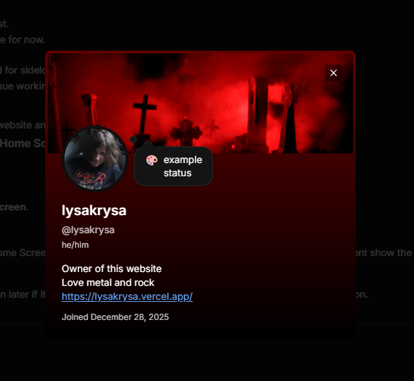
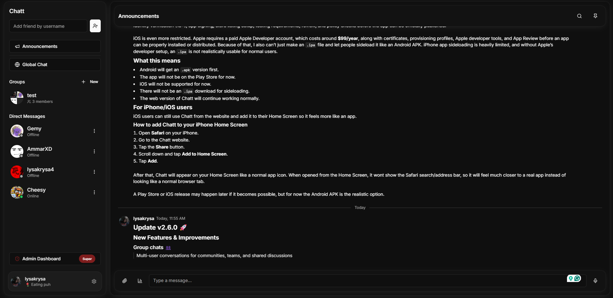
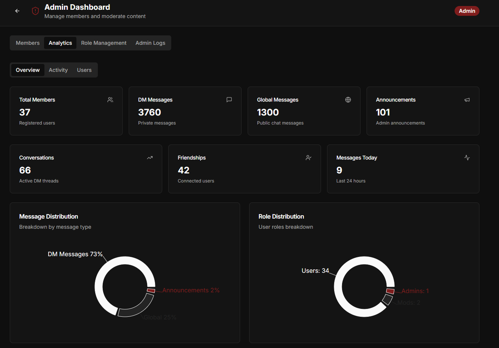

[](https://react.dev/)
[](https://www.typescriptlang.org/)
[](https://vitejs.dev/)
[](https://supabase.com/)
[](https://tailwindcss.com/)

Chatt is a real-time messaging app built with React, Vite, TypeScript, Tailwind CSS, shadcn/ui, and Supabase. It supports private chats, group conversations, global chat, announcements, user profiles, moderation tools, file sharing, voice messages, polls, mentions, reactions, and push notifications.

---

## Features ✨

- **Authentication**: Email login, signup, password reset, hCaptcha protection, and optional two-factor authentication.
- **Direct Messages**: One-to-one conversations created through the friends system.
- **Group Chats**: Group creation, member management, owner/admin/member roles, and group avatars.
- **Global Chat & Announcements**: Shared community channels alongside private conversations.
- **Rich Messages**: Replies, edits, deletes, emoji reactions, markdown rendering, @mentions, files, images, videos, music cards, and voice messages.
- **Polls**: Single-choice and multiple-choice polls inside conversations.
- **Profiles**: Username, display name, avatar, banner, bio, pronouns, custom status, and profile theme controls.
- **Settings**: Password, email, linked accounts, privacy, notification preferences, sessions, and theme settings.
- **Admin Dashboard**: Member management, analytics, role management, and admin logs.
- **Realtime Updates**: Supabase Realtime powers live messages, reactions, typing state, presence, and conversation changes.
- **Push Notifications**: ntfy-backed notification flow through Supabase Edge Functions.

## Demo 📸

| Preview |
|---------|
|  |
|  |
|  |

---

## Installation 🛠️

### 1. Clone the repository

```bash
git clone https://github.com/LysaKrysa/Chatt/tree/main
cd Chatt
```

### 2. Install dependencies

This project includes both Bun and npm lockfiles. Use one package manager and stick with it.

```bash
# Bun
bun install

# Or npm
npm install
```

### 3. Create your environment file

```bash
cp .env.example .env
```

Fill in your own Supabase and hCaptcha values:

```env
VITE_SUPABASE_PROJECT_ID="your-supabase-project-ref"
VITE_SUPABASE_URL="https://your-supabase-project-ref.supabase.co"
VITE_SUPABASE_PUBLISHABLE_KEY="your-supabase-anon-publishable-key"
VITE_HCAPTCHA_SITE_KEY="your-hcaptcha-site-key"
```

> **Important:** The current auth form requires `VITE_HCAPTCHA_SITE_KEY`. Login, signup, and forgot-password flows will not work correctly without it.

### 4. Update the Supabase client

The generated Supabase client currently contains a hardcoded project URL and anon key in:

```plaintext
src/integrations/supabase/client.ts
```

For your own deployment, replace those constants with Vite environment variables:

```ts
const SUPABASE_URL = import.meta.env.VITE_SUPABASE_URL;
const SUPABASE_PUBLISHABLE_KEY = import.meta.env.VITE_SUPABASE_PUBLISHABLE_KEY;
```

Never use a Supabase `service_role` key in frontend code.

### 5. Run the development server

```bash
# Bun
bun dev

# Or npm
npm run dev
```

Open the app at:

```plaintext
http://localhost:8080
```

---

## Supabase Setup 🧩

### 1. Create or link a Supabase project

Create a Supabase project, then copy your project ref, project URL, and anon/publishable key into `.env`.

If you use the Supabase CLI:

```bash
supabase login
supabase link --project-ref <your-project-ref>
```

Update:

```plaintext
supabase/config.toml
```

Set:

```toml
project_id = "<your-project-ref>"
```

### 2. Apply database migrations

Database migrations live in:

```plaintext
supabase/migrations/
```

Run them with:

```bash
supabase db push
```

You can also paste the migration SQL into the Supabase SQL editor if you are not using the CLI.

### 3. Enable auth settings

In Supabase Dashboard:

- Enable **Email** auth under Authentication providers.
- Add your deployed app URL as the Site URL.
- Add this redirect URL for password resets:

```plaintext
https://your-domain.com/reset-password
```

For local development, also allow:

```plaintext
http://localhost:8080/reset-password
```

### 4. Create storage buckets

Create these Supabase Storage buckets:

| Bucket | Public | Used for |
|--------|--------|----------|
| `avatars` | Yes | User avatars and group avatars |
| `banners` | Yes | Profile banners |
| `chat-images` | No | Image uploads |
| `chat-videos` | No | Video uploads |
| `chat-voice` | No | Voice messages |

Storage policies are handled by the migrations. Public buckets are for profile media; private buckets use signed URLs for chat attachments.

### 5. Deploy Edge Functions

Edge functions live in:

```plaintext
supabase/functions/
```

Deploy them with:

```bash
supabase functions deploy send-ntfy
supabase functions deploy purge-expired-attachments
```

Set these function secrets in Supabase:

| Secret | Used by |
|--------|---------|
| `SUPABASE_SERVICE_ROLE_KEY` | Server-side function access |
| `SUPABASE_ANON_KEY` | User JWT validation in purge flow |
| `PURGE_CRON_SECRET` | Optional shared secret for scheduled attachment cleanup |

---

## Usage 📖

### User Flow

1. Go to `/auth`.
2. Create an account or log in.
3. Complete email confirmation if your Supabase project requires it.
4. Set your username when prompted.
5. Add friends, start a DM, join global chat, or create a group.

### Main Routes

| Route | Description |
|-------|-------------|
| `/` | Auth-protected home route that loads the chat app |
| `/auth` | Login, signup, and forgot-password screen |
| `/reset-password` | Password recovery flow |
| `/chat` | Friends list, direct messages, and group chats |
| `/global-chat` | Global community chat |
| `/announcements` | Announcement channel |
| `/settings` | Profile, account, privacy, notification, and theme settings |
| `/admin` | Admin and moderation dashboard |

### Admin Access

Admin tools are controlled through the `user_roles` table. Users without an admin role are redirected away from `/admin`.

Typical roles:

- `user`
- `admin`
- `super_admin`

---

## Available Scripts ⚙️

| Script | Command | Description |
|--------|---------|-------------|
| Dev | `bun dev` / `npm run dev` | Start the Vite dev server |
| Build | `bun run build` / `npm run build` | Create a production build |
| Build Dev | `bun run build:dev` / `npm run build:dev` | Build using development mode |
| Preview | `bun run preview` / `npm run preview` | Preview the production build locally |
| Lint | `bun run lint` / `npm run lint` | Run ESLint |

---

## Code Overview 🧠

### Frontend

- `src/App.tsx` handles routing and password-recovery redirects.
- `src/pages/Auth.tsx` contains login, signup, forgot-password, hCaptcha, and MFA challenge flow.
- `src/components/chat/ChatLayout.tsx` manages the chat shell, mobile layout, active conversation, global chat, and announcements.
- `src/components/chat/ChatView.tsx` contains the main messaging experience.
- `src/pages/Settings.tsx` powers profile, account, privacy, security, and theme settings.
- `src/pages/AdminDashboard.tsx` controls admin-only member tools, analytics, roles, conversation moderation, and logs.

### Backend

- Supabase Auth manages users and sessions.
- Supabase Postgres stores profiles, conversations, messages, reactions, polls, roles, notifications, and moderation data.
- Supabase Realtime streams live chat updates.
- Supabase Storage stores avatars, banners, uploaded chat media, and voice messages.
- Supabase Edge Functions handle notification delivery and expired attachment cleanup.

---

## Folder Structure 📂

```plaintext
.
├── assets/                    # README banner and demo placeholders
├── public/                    # Static public files
├── src/
│   ├── components/
│   │   ├── admin/             # Admin dashboard components
│   │   ├── chat/              # Chat, friends, messages, groups, polls, media
│   │   ├── profile/           # User profile dialog
│   │   ├── settings/          # Account and profile settings
│   │   └── ui/                # shadcn/ui components
│   ├── hooks/                 # Auth, presence, mobile, role, toast, voice hooks
│   ├── integrations/
│   │   └── supabase/          # Supabase client and generated database types
│   ├── lib/                   # Utilities for chat, media, roles, MFA, mentions
│   ├── pages/                 # Route-level pages
│   ├── App.tsx                # App providers and routes
│   ├── main.tsx               # React entry point
│   └── index.css              # Tailwind and global styles
├── supabase/
│   ├── functions/             # Supabase Edge Functions
│   ├── migrations/            # Database schema and policy migrations
│   └── config.toml            # Supabase project config
├── .env.example               # Example frontend environment variables
├── package.json               # Scripts and dependencies
├── tailwind.config.ts         # Tailwind config
├── vite.config.ts             # Vite config
└── vercel.json                # Vercel SPA rewrite config
```

---

## Deployment 🚀

This project includes a `vercel.json` file for single-page app routing on Vercel.

1. Push the project to GitHub.
2. Import it into Vercel.
3. Add the same environment variables from `.env`.
4. Set the build command:

```bash
npm run build
```

5. Set the output directory:

```plaintext
dist
```

6. Add your deployed URL to Supabase Auth redirect URLs.

---

## Troubleshooting 🧯

### Auth says hCaptcha is missing

Set `VITE_HCAPTCHA_SITE_KEY` in `.env`, restart the dev server, and try again.

### Supabase requests fail

- Check `VITE_SUPABASE_URL` and `VITE_SUPABASE_PUBLISHABLE_KEY`.
- Make sure `src/integrations/supabase/client.ts` points at your project.
- Do not use the `service_role` key in the browser.
- Confirm migrations and RLS policies were applied.

### Realtime messages do not update

- Verify the relevant tables are enabled in the `supabase_realtime` publication.
- Check browser console logs for subscription errors.
- Confirm the logged-in user can read the rows under RLS.

### Uploads fail

- Confirm the required Storage buckets exist.
- Confirm Storage policies were applied.
- Check whether the file type belongs in `chat-images`, `chat-videos`, or `chat-voice`.

### Admin page redirects away

The signed-in user needs an admin role in the `user_roles` table.

---

## Contributing 🤝

Contributions are welcome. Open an issue for bugs or feature ideas, or fork the repository and submit a pull request.

## License 📝

Add a `LICENSE` file before publishing this repository publicly. If you want this to match your other projects, MIT is a good default for a small open-source app.
